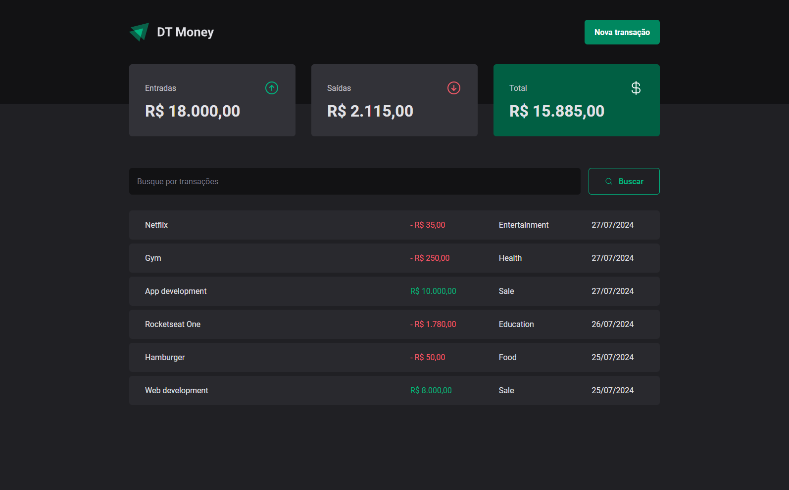

<h1 align="center">DT Money</h1>

<h2 align="center">With DT Money you can control your income, spending and view a total of your financial performance.</h2>

<p align="center">Project created with Vite, ReactJS and TypeScript.</p>



## Introduction

This app was used to train new and old concepts as the hooks, State, Effect, Context and Callback. Looking for more performance the [useContextSelector](https://github.com/dai-shi/use-context-selector) has used to replace useContext. I understand that there is not a real problem with app, but i wanted learn more about performance.

<p>The faker back-end json-server was used here.</p>

## Features

- Create a new transaction.
- List all transaction.
- Search transaction by query.
- Show the total of earnings, expenses and check if you're negative or positive.

## For run

NPM

```bash
npm install
npm run dev
```

## License

[](https://choosealicense.com/licenses/mit/)
